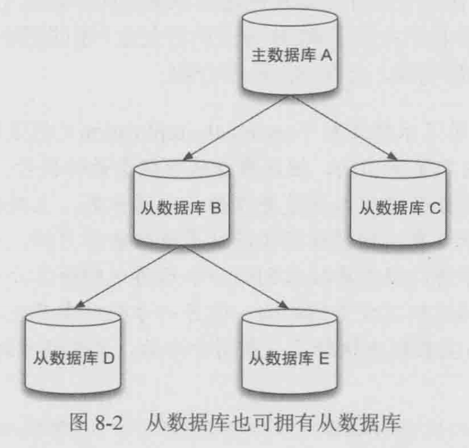
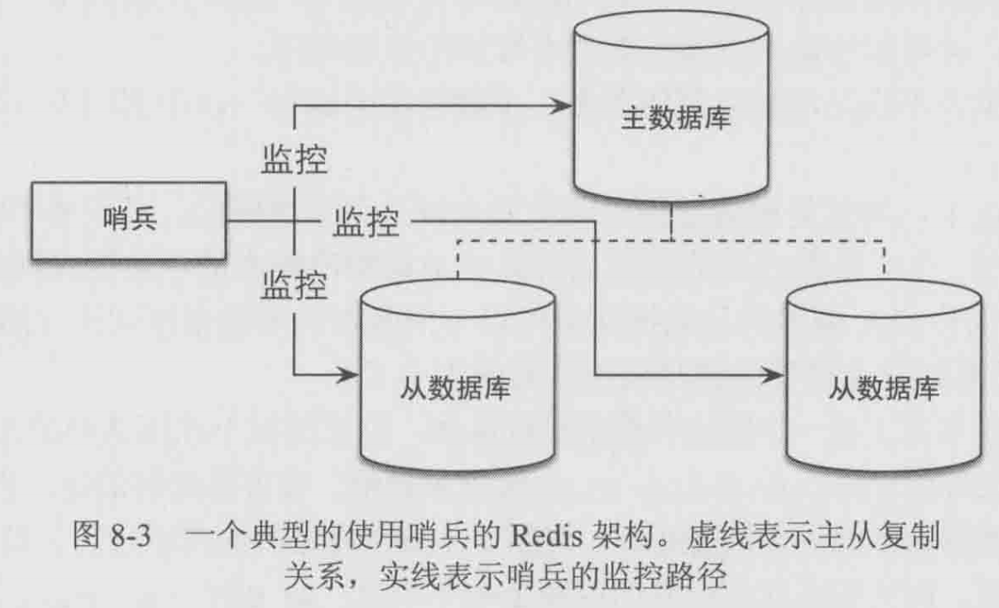
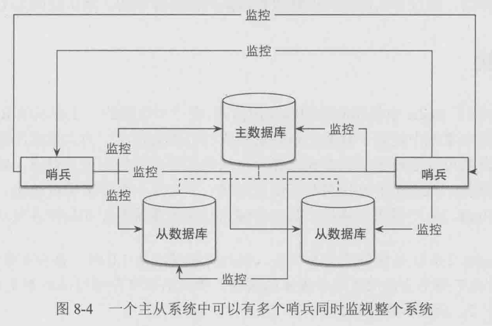

# 书籍

## Redis入门指南

[《Redis入门指南（第2版）(异步图书出品)》(李子骅)【摘要 书评 试读】- 京东图书 (jd.com)](https://item.jd.com/11685574.html)

源代码文件 redis-book-assets

### 第1章: 简介

字典结构存储数据

允许其他应用通过TCP协议读写字典中的内容

数据类型

- 字符串
- 散列
- 列表
- 集合
- 有序集合

默认支持16个数据库

### 第3章: 入门

#### 字符串类型

```shell
KEYS pattern

# 判断键存在
EXISTS key

# 删除键
DEL key

# 获得数据类型
TYPE key

SET key value
GET key

# 递增数字
INCR key
# 增加指定的整数
INCRBY key increment
# 减少数字
DECR key
# 减少指定的整数
DECRBY key decrement
# 增加指定浮点数
INCRBYFLOAT key increment

# 向尾部追加值
APPEND key value

# 获取字符串长度
STRLEN key

# 同时获得多个值
MGET key [key ...]

# 同时设置多个值
MSET key value [key value ...]

# 位操作
GETBIT key offset
SETBIT key offset value
BITCOUNT key [start] [end]
# 运算符有 AND OR XOR NOT
BITOP operation destkey key [key ...]
```

#### 散列类型

散列类型不能嵌套

散列类型适合存储对象

```shell
HSET key field value
HGET key field
HMSET key field value [field value ...]
HMGET key field [field ...]
HGETALL key

HSET car id 1
HSET car brand bmw

# 判断字段是否存在
HEXISTS key field

# 当字段不存在时赋值
HSETNX key field value

# 增加数字
HINCRBY key field increment

# 删除
HDEL key field [field ...]

# 获取所有字段名或值
HKEYS key
HVALS key

# 获得字段数量
HLEN key
```

#### 列表类型

```shell
# 向列表左边增加元素
LPUSH key value [value ...]
RPUSH key value [value ...]
LPOP key
RPOP key
LLEN key

# 获得列表片段
LRANGE key start stop

# 删除指定值
# 删除前count个值为value的元素
LREM key count value

# 获得/设置指定索引的元素值
LINDEX key index
LSET key index value

# 只保留列表指定片段
LTRIM key start end

# 向列表中插入元素
LINSERT key BEFORE/AFTER pivot value

# 将元素从一个列表转移到另一个列表
RPOPLPUSH source destination
```

#### 集合类型

```shell
SADD key number [number ...]
SREM key number [number ...]

# 获得集合中所有元素
SMEMBERS key

# 判断元素是否在集合中
SISMEMBER key number

# 集合间运算
SDIFF key [key ...]
SINTER key [key ...]
SUNION key [key ...]

# 集合中元素个数
SCARD key

# 进行集合运算并将结果存储
SDIFFSTORE destination key [key ...]
SINTERSTORE destination key [key ...]
SUNIONSTORE destination key [key ...]

# 随机获得集合中的元素
SRANDMEMBER key [count]

# 从集合中随机弹出元素
SPOP key
```

#### 有序集合类型

```shell
# 加入元素和元素的分数
ZADD key score member [score member ...]
# 获得元素的分数
ZSCORE key member
# 获得排名在某个范围的元素列表
# 请注意这里的start,stop是排名, 相当于索引
ZRANGE key start stop [WITHSCORES]
ZREVRANGE key start stop [WITHSCORES]
# 获得指定分数范围内的元素
ZRANGEBYSCORE key min max [WITHSCORES] [LIMIT offset count]
# 增加某个元素的分数
ZINCRBY key increment member
# 获得集合中元素的个数
ZCARD key
# 获得指定分数范围内的元素个数
ZCOUNT key min max
# 删除1个或多个元素
ZREM key member [member ...]
# 按照排名范围删除元素
ZREMRANGEBYRANK key start stop
# 按照分数范围删除元素
ZREMRANGEBYSCORE key min max
# 获得元素的排名
ZRANK key member
# 计算有序集合的交集
ZINTERSTORE destination numkeys key [key ...] [WEIGHTS weight [weight ...]] [AGGREGATE SUM|MIN|MAX]
```

### 第4章: 进阶

#### 事务

```shell
127.0.0.1:6379> MULTI
OK
127.0.0.1:6379(TX)> SET key 1
QUEUED
127.0.0.1:6379(TX)> SADD key 2
QUEUED
127.0.0.1:6379(TX)> SET key 3
QUEUED
127.0.0.1:6379(TX)> EXEC
1) OK
2) (error) WRONGTYPE Operation against a key holding the wrong kind of value
3) OK
127.0.0.1:6379> GET key
"3"
```

Redis 不支持回滚功能, 开发者必须在事务执行出错后自己收拾剩下的摊子

```shell
127.0.0.1:6379> SET key 1
OK
# WATCH了之后, 其他使用MULTI启动的事务就不能修改它了， 但是在本事务中可修改
127.0.0.1:6379> WATCH key
OK
127.0.0.1:6379> SET key 2
OK
127.0.0.1:6379> MULTI
OK
127.0.0.1:6379(TX)> SET key 3
QUEUED
127.0.0.1:6379(TX)> EXEC
(nil)
127.0.0.1:6379> GET key
"2"
```

#### 过期时间

```shell
# 设置键过期
EXPIRE key seconds
# TTL查看键还有多长时间过期
TTL key
# 设置永久
PERSIST key
```

#### 排序

```shell
SORT ... [BY ...]
```

SORT是Redis中最强大最复杂的命令之一, 如果使用不好容易造成性能瓶颈

#### 消息通知

BRPOP命令与RPOP命令类似, 唯一的区别是当列表中没有元素时BRPOP命令会一直阻塞住连接, 直到新元素加入。

```shell
# timeout是超时时间
BRPOP key timeout
```

优先级队列

```
BLPOP key [key ...] timeout
LPUSH queue:1 task1
LPUSH queue:2 task2
LPUSH queue:3 task3
BRPOP queue:1 queue:2 queue:3

```

发布/订阅模式

```shell
PUBLISH channel message
SUBSCRIBE channel [channel ...]

# 按照规则订阅
PSUBSCRIBE ...
```

## 第7章: 持久化

- RDB

  根据指定规则定时将内存中的数据存储在硬盘上

- AOF

  每次执行命令后将命令本身记录下来

两种持久化可以结合使用

#### RDB

通过快照完成, RDB对数据进行快照的情况

- 根据配置规则进行自动快照
- 用户执行SAVE或BGSAVE命令
- 执行FLUSHALL命令
- 执行复制replication时

## 第9章: 集群

#### 复制(replication)

当一台数据库中的数据更新后, 自动将更新的数据同步到其他数据库上




#### 哨兵(sentinel)





#### 集群(cluster)

Redis 3.0开始支持

集群的特点在于拥有和单机实例同样的性能, 同时在网络分区后能够提供一定的可访问性以及对主数据库故障恢复的支持


# 命令

[Command reference – Redis](https://redis.io/commands)


# DBAnt

通过 keys * 可以得到所有的键

# Docker

```shell
# 下载
docker pull redis

# 运行
docker run --name redis -d redis

# 停止
docker stop redis

# 第2次运行
docker start redis

# 进入docker bash
docker exec -it redis bash

# 查看日志
docker logs redis
```

